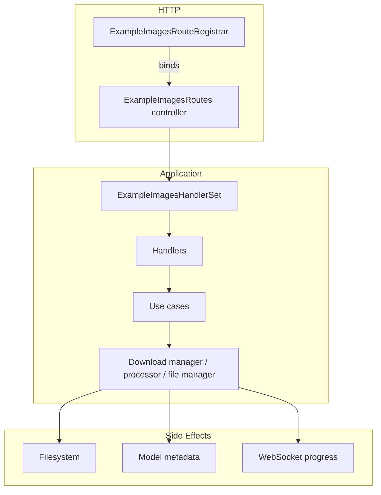

# Example image route architecture

The example image routing stack mirrors the layered model route stack described in
[`docs/architecture/model_routes.md`](model_routes.md). HTTP wiring, controller setup,
handler orchestration, and long-running workflows now live in clearly separated modules so
we can extend download/import behaviour without touching the entire feature surface.

## Layer responsibilities

| Layer | Module(s) | Responsibility |
| --- | --- | --- |
| Registrar | `py/routes/example_images_route_registrar.py` | Declarative catalogue of every example image endpoint plus helpers that bind them to an `aiohttp` router. Keeps HTTP concerns symmetrical with the model registrar. |
| Controller | `py/routes/example_images_routes.py` | Lazily constructs `ExampleImagesHandlerSet`, injects defaults for the download manager, processor, and file manager, and exposes the registrar-ready mapping just like `BaseModelRoutes`. |
| Handler set | `py/routes/handlers/example_images_handlers.py` | Groups HTTP adapters by concern (downloads, imports/deletes, filesystem access). Each handler translates domain errors into HTTP responses and defers to a use case or utility service. |
| Use cases | `py/services/use_cases/example_images/*.py` | Encapsulate orchestration for downloads and imports. They validate input, translate concurrency/configuration errors, and keep handler logic declarative. |
| Supporting services | `py/utils/example_images_download_manager.py`, `py/utils/example_images_processor.py`, `py/utils/example_images_file_manager.py` | Execute long-running work: pull assets from Civitai, persist uploads, clean metadata, expose filesystem actions with guardrails, and broadcast progress snapshots. |

## Handler responsibilities & invariants

`ExampleImagesHandlerSet` flattens the handler objects into the `{"handler_name": coroutine}`
mapping consumed by the registrar. The table below outlines how each handler collaborates
with the use cases and utilities.

| Handler | Key endpoints | Collaborators | Contracts |
| --- | --- | --- | --- |
| `ExampleImagesDownloadHandler` | `/api/lm/download-example-images`, `/api/lm/example-images-status`, `/api/lm/pause-example-images`, `/api/lm/resume-example-images`, `/api/lm/force-download-example-images` | `DownloadExampleImagesUseCase`, `DownloadManager` | Delegates payload validation and concurrency checks to the use case; progress/status endpoints expose the same snapshot used for WebSocket broadcasts; pause/resume surface `DownloadNotRunningError` as HTTP 400 instead of 500. |
| `ExampleImagesManagementHandler` | `/api/lm/import-example-images`, `/api/lm/delete-example-image` | `ImportExampleImagesUseCase`, `ExampleImagesProcessor` | Multipart uploads are streamed to disk via the use case; validation failures return HTTP 400 with no filesystem side effects; deletion funnels through the processor to prune metadata and cached images consistently. |
| `ExampleImagesFileHandler` | `/api/lm/open-example-images-folder`, `/api/lm/example-image-files`, `/api/lm/has-example-images` | `ExampleImagesFileManager` | Centralises filesystem access, enforcing settings-based root paths and returning HTTP 400/404 for missing configuration or folders; responses always include `success`/`has_images` booleans for UI consumption. |

## Use case boundaries

| Use case | Entry point | Dependencies | Guarantees |
| --- | --- | --- | --- |
| `DownloadExampleImagesUseCase` | `execute(payload)` | `DownloadManager.start_download`, download configuration errors | Raises `DownloadExampleImagesInProgressError` when the manager reports an active job, rewraps configuration errors into `DownloadExampleImagesConfigurationError`, and lets `ExampleImagesDownloadError` bubble as 500s so handlers do not duplicate logging. |
| `ImportExampleImagesUseCase` | `execute(request)` | `ExampleImagesProcessor.import_images`, temporary file helpers | Supports multipart or JSON payloads, normalises file paths into a single list, cleans up temp files even on failure, and maps validation issues to `ImportExampleImagesValidationError` for HTTP 400 responses. |

## Maintaining critical invariants

* **Shared progress snapshots** - The download handler returns the same snapshot built by
  `DownloadManager`, guaranteeing parity between HTTP polling endpoints and WebSocket
  progress events.
* **Safe filesystem access** - All folder/file actions flow through
  `ExampleImagesFileManager`, which validates the configured example image root and ensures
  responses never leak absolute paths outside the allowed directory.
* **Metadata hygiene** - Import/delete operations run through `ExampleImagesProcessor`,
  which updates model metadata via `MetadataManager` and notifies the relevant scanners so
  cache state stays in sync.

## Migration notes

The refactor brings the example image stack in line with the model/recipe stacks:

1. `ExampleImagesRouteRegistrar` now owns the declarative route list. Downstream projects
   should rely on `ExampleImagesRoutes.to_route_mapping()` instead of manually wiring
   handler callables.
2. `ExampleImagesRoutes` caches its `ExampleImagesHandlerSet` just like
   `BaseModelRoutes`. If you previously instantiated handlers directly, inject custom
   collaborators via the controller constructor (`download_manager`, `processor`,
   `file_manager`) to keep test seams predictable.
3. Tests that mocked `ExampleImagesRoutes.setup_routes` should switch to patching
   `DownloadExampleImagesUseCase`/`ImportExampleImagesUseCase` at import time. The handlers
   expect those abstractions to surface validation/concurrency errors, and bypassing them
   will skip the HTTP-friendly error mapping.

## Extending the stack

1. Add the endpoint to `ROUTE_DEFINITIONS` with a unique `handler_name`.
2. Expose the coroutine on an existing handler class (or create a new handler and extend
   `ExampleImagesHandlerSet`).
3. Wire additional services or factories inside `_build_handler_set` on
   `ExampleImagesRoutes`, mirroring how the model stack introduces new use cases.

`tests/routes/test_example_images_routes.py` exercises registrar binding, download pause
flows, and import validations. Use it as a template when introducing new handler
collaborators or error mappings.
