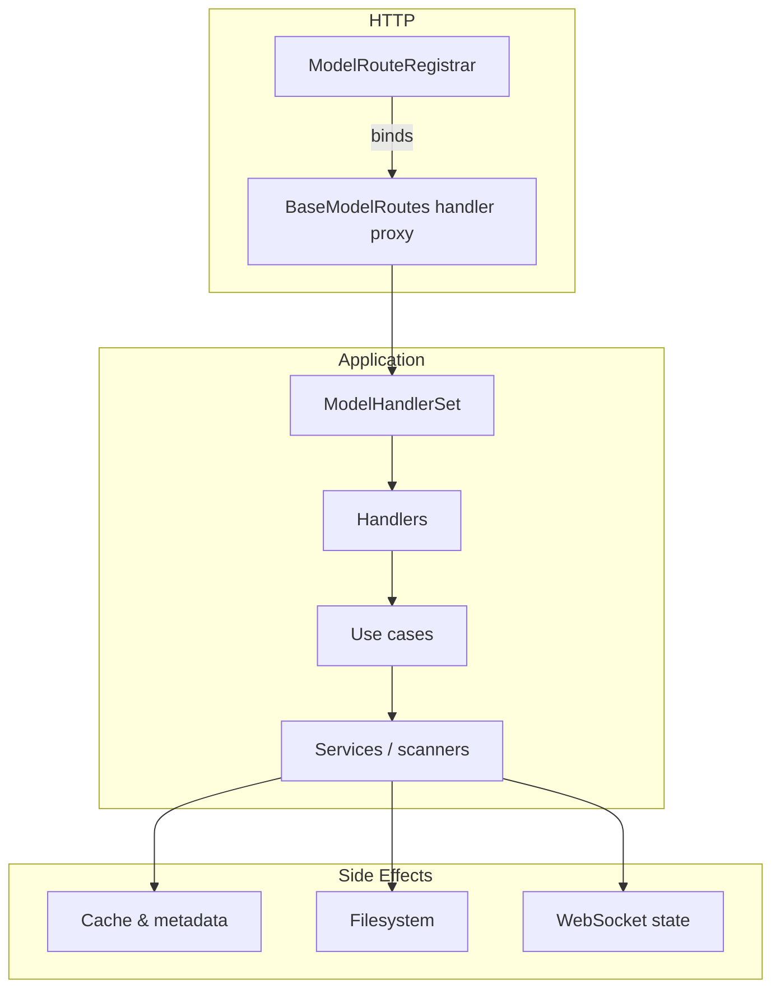

# Base model route architecture

The model routing stack now splits HTTP wiring, orchestration logic, and
business rules into discrete layers.  The goal is to make it obvious where a
new collaborator should live and which contract it must honour.  The diagram
below captures the end-to-end flow for a typical request:

Every box maps to a concrete module:

| Layer | Module(s) | Responsibility |
| --- | --- | --- |
| Registrar | `py/routes/model_route_registrar.py` | Declarative list of routes shared by every model type and helper methods for binding them to an `aiohttp` application. |
| Route controller | `py/routes/base_model_routes.py` | Constructs the handler graph, injects shared services, exposes proxies that surface `503 Service not ready` when the model service has not been attached. |
| Handler set | `py/routes/handlers/model_handlers.py` | Thin HTTP adapters grouped by concern (page rendering, listings, mutations, queries, downloads, CivitAI integration, move operations, auto-organize). |
| Use cases | `py/services/use_cases/*.py` | Encapsulate long-running flows (`DownloadModelUseCase`, `BulkMetadataRefreshUseCase`, `AutoOrganizeUseCase`).  They normalise validation errors and concurrency constraints before returning control to the handlers. |
| Services | `py/services/*.py` | Existing services and scanners that mutate caches, write metadata, move files, and broadcast WebSocket updates. |

## Handler responsibilities & contracts

`ModelHandlerSet` flattens the handler objects into the exact callables used by
the registrar.  The table below highlights the separation of concerns within
the set and the invariants that must hold after each handler returns.

| Handler | Key endpoints | Collaborators | Contracts |
| --- | --- | --- | --- |
| `ModelPageView` | `/{prefix}` | `SettingsManager`, `server_i18n`, Jinja environment, `service.scanner` | Template is rendered with `is_initializing` flag when caches are cold; i18n filter is registered exactly once per environment instance. |
| `ModelListingHandler` | `/api/lm/{prefix}/list` | `service.get_paginated_data`, `service.format_response` | Listings respect pagination query parameters and cap `page_size` at 100; every item is formatted before response. |
| `ModelManagementHandler` | Mutations (delete, exclude, metadata, preview, tags, rename, bulk delete, duplicate verification) | `ModelLifecycleService`, `MetadataSyncService`, `PreviewAssetService`, `TagUpdateService`, scanner cache/index | Cache state mirrors filesystem changes: deletes prune cache & hash index, preview replacements synchronise metadata and cache NSFW levels, metadata saves trigger cache resort when names change. |
| `ModelQueryHandler` | Read-only queries (top tags, folders, duplicates, metadata, URLs) | Service query helpers & scanner cache | Outputs always wrapped in `{"success": True}` when no error; duplicate/filename grouping omits empty entries; invalid parameters (e.g. missing `model_root`) return HTTP 400. |
| `ModelDownloadHandler` | `/api/lm/download-model`, `/download-model-get`, `/download-progress/{id}`, `/cancel-download-get` | `DownloadModelUseCase`, `DownloadCoordinator`, `WebSocketManager` | Payload validation errors become HTTP 400 without mutating download progress cache; early-access failures surface as HTTP 401; successful downloads cache progress snapshots that back both WebSocket broadcasts and polling endpoints. |
| `ModelCivitaiHandler` | CivitAI metadata routes | `MetadataSyncService`, metadata provider factory, `BulkMetadataRefreshUseCase` | `fetch_all_civitai` streams progress via `WebSocketBroadcastCallback`; version lookups validate model type before returning; local availability fields derive from hash lookups without mutating cache state. |
| `ModelMoveHandler` | `move_model`, `move_models_bulk` | `ModelMoveService` | Moves execute atomically per request; bulk operations aggregate success/failure per file set. |
| `ModelAutoOrganizeHandler` | `/api/lm/{prefix}/auto-organize` (GET/POST), `/auto-organize-progress` | `AutoOrganizeUseCase`, `WebSocketProgressCallback`, `WebSocketManager` | Enforces single-flight execution using the shared lock; progress broadcasts remain available to polling clients until explicitly cleared; conflicts return HTTP 409 with a descriptive error. |

## Use case boundaries

Each use case exposes a narrow asynchronous API that hides the underlying
services.  Their error mapping is essential for predictable HTTP responses.

| Use case | Entry point | Dependencies | Guarantees |
| --- | --- | --- | --- |
| `DownloadModelUseCase` | `execute(payload)` | `DownloadCoordinator.schedule_download` | Translates `ValueError` into `DownloadModelValidationError` for HTTP 400, recognises early-access errors (`"401"` in message) and surfaces them as `DownloadModelEarlyAccessError`, forwards success dictionaries untouched. |
| `AutoOrganizeUseCase` | `execute(file_paths, progress_callback)` | `ModelFileService.auto_organize_models`, `WebSocketManager` lock | Guarded by `ws_manager` lock + status checks; raises `AutoOrganizeInProgressError` before invoking the file service when another run is already active. |
| `BulkMetadataRefreshUseCase` | `execute_with_error_handling(progress_callback)` | `MetadataSyncService`, `SettingsManager`, `WebSocketBroadcastCallback` | Iterates through cached models, applies metadata sync, emits progress snapshots that handlers broadcast unchanged. |

## Maintaining legacy contracts

The refactor preserves the invariants called out in the previous architecture
notes.  The most critical ones are reiterated here to emphasise the
collaboration points:

1. **Cache mutations** – Delete, exclude, rename, and bulk delete operations are
   channelled through `ModelManagementHandler`.  The handler delegates to
   `ModelLifecycleService` or `MetadataSyncService`, and the scanner cache is
   mutated in-place before the handler returns.  The accompanying tests assert
   that `scanner._cache.raw_data` and `scanner._hash_index` stay in sync after
   each mutation.
2. **Preview updates** – `PreviewAssetService.replace_preview` writes the new
   asset, `MetadataSyncService` persists the JSON metadata, and
   `scanner.update_preview_in_cache` mirrors the change.  The handler returns
   the static URL produced by `config.get_preview_static_url`, keeping browser
   clients in lockstep with disk state.
3. **Download progress** – `DownloadCoordinator.schedule_download` generates the
   download identifier, registers a WebSocket progress callback, and caches the
   latest numeric progress via `WebSocketManager`.  Both `download_model`
   responses and `/download-progress/{id}` polling read from the same cache to
   guarantee consistent progress reporting across transports.

## Extending the stack

To add a new shared route:

1. Declare it in `COMMON_ROUTE_DEFINITIONS` using a unique handler name.
2. Implement the corresponding coroutine on one of the handlers inside
   `ModelHandlerSet` (or introduce a new handler class when the concern does not
   fit existing ones).
3. Inject additional dependencies in `BaseModelRoutes._create_handler_set` by
   wiring services or use cases through the constructor parameters.

Model-specific routes should continue to be registered inside the subclass
implementation of `setup_specific_routes`, reusing the shared registrar where
possible.
