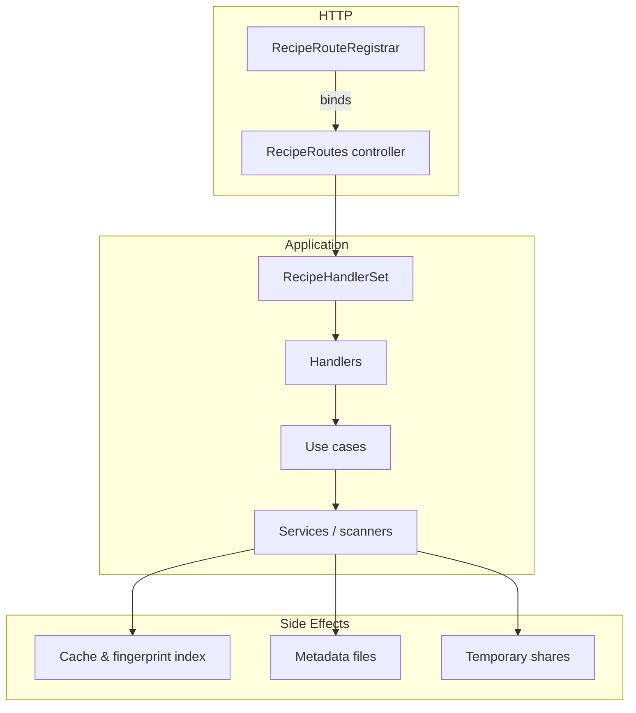

# Recipe route architecture

The recipe routing stack now mirrors the modular model route design. HTTP
bindings, controller wiring, handler orchestration, and business rules live in
separate layers so new behaviours can be added without re-threading the entire
feature. The diagram below outlines the flow for a typical request:

## Layer responsibilities

| Layer | Module(s) | Responsibility |
| --- | --- | --- |
| Registrar | `py/routes/recipe_route_registrar.py` | Declarative list of every recipe endpoint and helper methods that bind them to an `aiohttp` application. |
| Controller | `py/routes/base_recipe_routes.py`, `py/routes/recipe_routes.py` | Lazily resolves scanners/clients from the service registry, wires shared templates/i18n, instantiates `RecipeHandlerSet`, and exposes a `{handler_name: coroutine}` mapping for the registrar. |
| Handler set | `py/routes/handlers/recipe_handlers.py` | Thin HTTP adapters grouped by concern (page view, listings, queries, mutations, sharing). They normalise responses and translate service exceptions into HTTP status codes. |
| Services & scanners | `py/services/recipes/*.py`, `py/services/recipe_scanner.py`, `py/services/service_registry.py` | Concrete business logic: metadata parsing, persistence, sharing, fingerprint/index maintenance, and cache refresh. |

## Handler responsibilities & invariants

`RecipeHandlerSet` flattens purpose-built handler objects into the callables the
registrar binds. Each handler is responsible for a narrow concern and enforces a
set of invariants before returning:

| Handler | Key endpoints | Collaborators | Contracts |
| --- | --- | --- | --- |
| `RecipePageView` | `/loras/recipes` | `SettingsManager`, `server_i18n`, Jinja environment, recipe scanner getter | Template rendered with `is_initializing` flag when caches are still warming; i18n filter registered exactly once per environment instance. |
| `RecipeListingHandler` | `/api/lm/recipes`, `/api/lm/recipe/{id}` | `recipe_scanner.get_paginated_data`, `recipe_scanner.get_recipe_by_id` | Listings respect pagination and search filters; every item receives a `file_url` fallback even when metadata is incomplete; missing recipes become HTTP 404. |
| `RecipeQueryHandler` | Tag/base-model stats, syntax, LoRA lookups | Recipe scanner cache, `format_recipe_file_url` helper | Cache snapshots are reused without forcing refresh; duplicate lookups collapse groups by fingerprint; syntax lookups return helpful errors when LoRAs are absent. |
| `RecipeManagementHandler` | Save, update, reconnect, bulk delete, widget ingest | `RecipePersistenceService`, `RecipeAnalysisService`, recipe scanner | Persistence results propagate HTTP status codes; fingerprint/index updates flow through the scanner before returning; validation errors surface as HTTP 400 without touching disk. |
| `RecipeAnalysisHandler` | Uploaded/local/remote analysis | `RecipeAnalysisService`, `civitai_client`, recipe scanner | Unsupported content types map to HTTP 400; download errors (`RecipeDownloadError`) are not retried; every response includes a `loras` array for client compatibility. |
| `RecipeSharingHandler` | Share + download | `RecipeSharingService`, recipe scanner | Share responses provide a stable download URL and filename; expired shares surface as HTTP 404; downloads stream via `web.FileResponse` with attachment headers. |

## Use case boundaries

The dedicated services encapsulate long-running work so handlers stay thin.

| Use case | Entry point | Dependencies | Guarantees |
| --- | --- | --- | --- |
| `RecipeAnalysisService` | `analyze_uploaded_image`, `analyze_remote_image`, `analyze_local_image`, `analyze_widget_metadata` | `ExifUtils`, `RecipeParserFactory`, downloader factory, optional metadata collector/processor | Normalises missing/invalid payloads into `RecipeValidationError`; generates consistent fingerprint data to keep duplicate detection stable; temporary files are cleaned up after every analysis path. |
| `RecipePersistenceService` | `save_recipe`, `delete_recipe`, `update_recipe`, `reconnect_lora`, `bulk_delete`, `save_recipe_from_widget` | `ExifUtils`, recipe scanner, card preview sizing constants | Writes images/JSON metadata atomically; updates scanner caches and hash indices before returning; recalculates fingerprints whenever LoRA assignments change. |
| `RecipeSharingService` | `share_recipe`, `prepare_download` | `tempfile`, recipe scanner | Copies originals to TTL-managed temp files; metadata lookups re-use the scanner; expired shares trigger cleanup and `RecipeNotFoundError`. |

## Maintaining critical invariants

* **Cache updates** – Mutations (`save`, `delete`, `bulk_delete`, `update`) call
  back into the recipe scanner to mutate the in-memory cache and fingerprint
  index before returning a response. Tests assert that these methods are invoked
  even when stubbing persistence.
* **Fingerprint management** – `RecipePersistenceService` recomputes
  fingerprints whenever LoRA metadata changes and duplicate lookups use those
  fingerprints to group recipes. Handlers bubble the resulting IDs so clients
  can merge duplicates without an extra fetch.
* **Metadata synchronisation** – Saving or reconnecting a recipe updates the
  JSON sidecar, refreshes embedded metadata via `ExifUtils`, and instructs the
  scanner to resort its cache. Sharing relies on this metadata to generate
  filenames and ensure downloads stay in sync with on-disk state.

## Extending the stack

1. Declare the new endpoint in `ROUTE_DEFINITIONS` with a unique handler name.
2. Implement the coroutine on an existing handler or introduce a new handler
   class inside `py/routes/handlers/recipe_handlers.py` when the concern does
   not fit existing ones.
3. Wire additional collaborators inside
   `BaseRecipeRoutes._create_handler_set` (inject new services or factories) and
   expose helper getters on the handler owner if the handler needs to share
   utilities.

Integration tests in `tests/routes/test_recipe_routes.py` exercise the listing,
mutation, analysis-error, and sharing paths end-to-end, ensuring the controller
and handler wiring remains valid as new capabilities are added.

