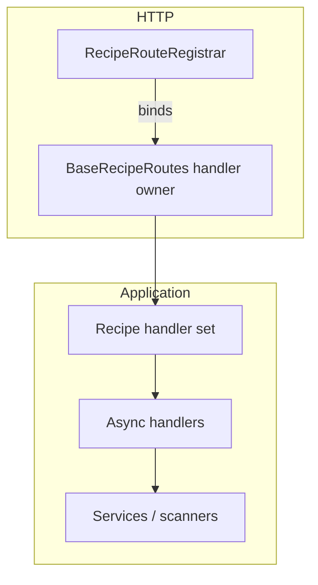

# Recipe route scaffolding

The recipe HTTP stack is being migrated to mirror the shared model routing
architecture.  The first phase extracts the registrar/controller scaffolding so
future handler sets can plug into a stable surface area.  The stack now mirrors
the same separation of concerns described in
`docs/architecture/model_routes.md`:

## Responsibilities

| Layer | Module(s) | Responsibility |
| --- | --- | --- |
| Registrar | `py/routes/recipe_route_registrar.py` | Declarative list of every recipe endpoint and helper that binds them to an `aiohttp` application. |
| Base controller | `py/routes/base_recipe_routes.py` | Lazily resolves shared services, registers the server-side i18n filter exactly once, pre-warms caches on startup, and exposes a `{handler_name: coroutine}` mapping used by the registrar. |
| Handler set (upcoming) | `py/routes/handlers/recipe_handlers.py` (planned) | Will group HTTP handlers by concern (page rendering, listings, mutations, queries, sharing) and surface them to `BaseRecipeRoutes.get_handler_owner()`. |

`RecipeRoutes` subclasses the base controller to keep compatibility with the
existing monolithic handlers.  Once the handler set is extracted the subclass
will simply provide the concrete owner returned by `get_handler_owner()`.

## High-level test baseline

The new smoke suite in `tests/routes/test_recipe_route_scaffolding.py`
guarantees the registrar/controller contract remains intact:

* `BaseRecipeRoutes.attach_dependencies` resolves registry services only once
  and protects the i18n filter from duplicate registration.
* Startup hooks are appended exactly once so cache pre-warming and dependency
  resolution run during application boot.
* `BaseRecipeRoutes.to_route_mapping()` uses the handler owner as the source of
  callables, enabling the upcoming handler set without touching the registrar.
* `RecipeRouteRegistrar` binds every declarative route to the aiohttp router.
* `RecipeRoutes.setup_routes` wires the registrar and startup hooks together so
  future refactors can swap in the handler set without editing callers.

These guardrails mirror the expectations in the model route architecture and
provide confidence that future refactors can focus on handlers and use cases
without breaking HTTP wiring.
